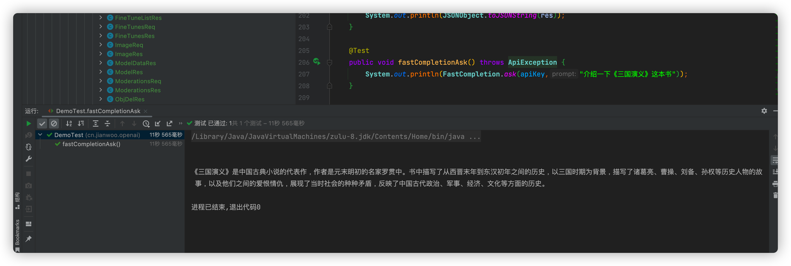

# ChatGpt 官方API封装，支持 GPT3.5!开箱即用!


这个 SDK 已经对接了官方的所有 SDK，包括了事件流式(text/event-stream)异步读取数据,
已经支持最新的GPT3.5模型和whisper-1模型，支持语音功能!

[English Doc](README_en.md).

## 版本日志
- 1.0.0 支持所有的OpenAI官方接口，支持代理，支持流式传输;
- 1.0.2 支持最新的GPT-3.5-Turbo模型和Whisper-1模型;
- 1.0.3 修复一些已知问题;
- 1.0.4 修复一些已知问题 [issues #5](https://github.com/gulihua10010/chatGptApiSdk/issues/5);
- 1.0.5 流式调用新增是否传输完成字段;
- 1.0.6 支持gpt-4，查询账单明细，支持自定义Api端点;
- 1.0.7 支持设置超时时间，以及超时后是否自动重试(仅支持completions/completionsStream/completionsChat/completionsChatStream 这 4 个 API)，流式响应的返回增加是否成功的字段，如果是失败，则返回失败信息和异常详情，取代之前直接抛出运行时异常;
- 1.0.8 修复一些已知问题;
- 1.0.9 官方已经修复账单明细的 bug，版本1.0.6中的查询账单明细的接口已经不可用，已经移除
- 1.0.10 再次新增账单查询功能，优化流式请求(okHttpClient设置为单例)，代理新增设置用户名密码功能


## 用法

### 导入依赖

```xml

<dependency>
    <groupId>cn.jianwoo.openai</groupId>
    <artifactId>ChatGpt-API-SDK</artifactId>
    <version>1.0.10</version>
</dependency>

<!--如果获取不到依赖，可以指定下仓库地址-->
<repositories>
<repository>
    <id>nexues</id>
    <name>snapshots</name>
    <url>https://s01.oss.sonatype.org/content/groups/public/</url>
    <releases>
        <enabled>true</enabled>
    </releases>
    <snapshots>
        <enabled>true</enabled>
        <updatePolicy>always</updatePolicy>
    </snapshots>
</repository>
</repositories>
```
### 调用
```java
        // 初始化服务
        PostApiService service = new ChatGptApiPost(new OpenAiAuth("<apiKey>"));
        // 请求服务
        CompletionRes res = service.completions(CompletionReq.builder().model("text-davinci-003").prompt("<问题>").build());

```
### GPT-3.5
```java
        // 初始化服务
        PostApiService service = new ChatGptApiPost(new OpenAiAuth("<apiKey>"));
        // 请求服务
        CompletionReq req = CompletionReq.builder().model(Model.GPT_35_TURBO.getName())
            .messages(
             Collections.singletonList(MessageReq.builder().role(Role.USER.getName()).content("你好").build()))
        .build();
        CompletionRes res = service.completionsChat(req);
        System.out.println(JSONObject.toJSONString(res))
```
### 使用代理

```java
        // 初始化服务
        // <host>不带 http或者https前缀!
        Proxy proxy = new Proxy(Proxy.Type.HTTP, new InetSocketAddress("<host>","<port>"));
        PostApiService service = new ChatGptApiPost(new OpenAiAuth("<apiKey>", proxy));
        // 请求服务
        CompletionRes res = service.completions(CompletionReq.builder().model("text-davinci-003").prompt("<问题>").build());

```
### 异步流式读取响应

```java
    @Test
    public void completionsStream() throws Exception {
        CompletionReq req = CompletionReq.builder().model("text-ada-001").prompt("介绍下《水浒传》这本书").build();
        service.completionsStream(req, res -> {
            // 回调方法
            System.out.println(JSONObject.toJSONString(res));
        });
    }
```
### 快速使用
```java
  System.out.println(FastCompletion.ask("<apiKey>","介绍一下《三国演义》这本书"));
  System.out.println(FastCompletion.chat("<apiKey>","介绍一下《三国演义》这本书"));
```

### 根据描述生成图片
```java
    // 返回一个 url 地址
    ImageRes res = OpenAiAuth.builder().apiKey(apiKey).post()
        .imageCreate(ImageReq.builder().prompt(prompt).build());
        return res.getData().get(0).getUrl();
```
### 音频转录
```java
        File audio = new File("/Users/gulihua/Downloads/audio.mp3");
        AudioReq req = AudioReq.builder().file(audio).build();
        AudioRes res = service.audioTranscribes(req);
        System.out.println(JSONObject.toJSONString(res));
```

## 已完成接口列表：
- [x] Models
- [x] Completions
- [x] Chat
- [x] Edits
- [x] Images
- [x] Embeddings
- [x] Audio
- [x] Files
- [x] Fine-tunes
- [x] Moderations
- [x] Engines


## 常用的模型枚举
```java
cn.jianwoo.openai.chatgptapi.constants.Model
```
## 如何连续对话/记住上下文
把之前的对话传进去就行了，可以参考下面的测试用例

## 其他ChatGpt相关项目
- 基于uni-app构建的微信小程序:https://github.com/gulihua10010/wxmini-chatgpt
- 微信小程序服务端API程序:https://github.com/gulihua10010/chatGptApi
- openAi授权SDK:https://github.com/gulihua10010/openAiAuth
- chatGpt API SDK:https://github.com/gulihua10010/chatGptApiSdk
- chatGpt命令行客户端:https://github.com/gulihua10010/ChatGpt

## 示例

```java

import cn.jianwoo.openai.chatgptapi.completions.FastCompletion;
import org.junit.jupiter.api.Test;

import com.alibaba.fastjson2.JSONObject;
import cn.jianwoo.openai.chatgptapi.exception.ApiException;

@Test
public void fastCompletionAsk() throws ApiException {
        System.out.println(FastCompletion.ask(apiKey,"介绍一下《三国演义》这本书"));
}

```
### 输出
```
《三国演义》是中国古典小说的代表作，作者是元末明初的名家罗贯中。书中描写了从西晋末年到东汉初年之间的历史，以三国时期为背景，描写了诸葛亮、曹操、刘备、孙权等历史人物的故事，以及他们之间的爱恨情仇，展现了当时社会的种种矛盾，反映了中国古代政治、军事、经济、文化等方面的历史。
```

## 测试用例

```java
    String apiKey = "sk-N*************************************goY";
    PostApiService service = new ChatGptApiPost(new OpenAiAuth(apiKey));

    /**
     *
     * 列出模型
     *
     * @author gulihua
     */
    @Test
    public void models() throws ApiException
    {
        ModelRes res = service.models();
        System.out.println(JSONObject.toJSONString(res));
    }


    /**
     *
     * 检索模型
     *
     * @author gulihua
     */
    @Test
    public void model() throws ApiException
    {
        ModelDataRes res = service.model("text-davinci-001");
        System.out.println(JSONObject.toJSONString(res));
    }


    /**
     *
     * 创建AI对话
     *
     * @author gulihua
     */
    @Test
    public void completions() throws ApiException
    {
        CompletionReq req = CompletionReq.builder().model("text-ada-001").prompt("你好").build();
        CompletionRes res = service.completions(req);
        System.out.println(JSONObject.toJSONString(res));
    }
    /**
     *
     * 连续对话
     *
     * @author gulihua
     */
    @Test
    public void completionsContext() throws ApiException
    {
        CompletionReq req = CompletionReq.builder().model(Model.TEXT_DAVINCI_003.getName())
           .stop("[\" Human:\", \" Bot:\"]").prompt("Human: 你好").build();
        CompletionRes res = service.completions(req);
        System.out.println(JSONObject.toJSONString(res));
        req.setPrompt(res.getAnswer() + "\n" + "Human: 你叫什么");
        res = service.completions(req);
        System.out.println(JSONObject.toJSONString(res));
    }

    /**
     *
     * 创建异步对话(流式)
     *
     * @author gulihua
     */
    public static void completionsStream() throws Exception
    {
        CompletionReq req = CompletionReq.builder().model("text-davinci-003").prompt("你是什么模型").build();
        service.completionsStream(req, res -> {
            // 回调方法
            if (res != null)
            {
                System.out.println(res.getAnswer());
            }
        });
    }


    /**
     *
     * 使用gpt-3.5-turbo模型聊天
     *
     * @author gulihua
     */
     @Test
    public void completionsChat() throws ApiException
    {
        CompletionReq req = CompletionReq.builder().model(Model.GPT_35_TURBO.getName())
        .messages(
        Collections.singletonList(MessageReq.builder().role(Role.USER.getName()).content("你好").build()))
        .build();
        CompletionRes res = service.completionsChat(req);
        System.out.println(JSONObject.toJSONString(res));
    }


    /**
     *
     * 使用gpt-3.5-turbo模型聊天
     *
     * @author gulihua
     */
    @Test
    public void completionsChatContext() throws ApiException
    {
        CompletionReq req = CompletionReq.builder().model(Model.GPT_35_TURBO.getName())
            .messages(
        Collections.singletonList(MessageReq.builder().role(Role.USER.getName()).content("请重复我的话").build()))
            .build();
        CompletionRes res = service.completionsChat(req);
        System.out.println(JSONObject.toJSONString(res));
        List<MessageReq> messages = new ArrayList<>();
        messages.add(res.getChoices().get(0).getMessage());
        messages.add(MessageReq.builder().role(Role.USER.getName()).content("我是中国人").build());
        req.setMessages(messages);
        res = service.completionsChat(req);
        System.out.println(JSONObject.toJSONString(res));
    }

    /**
     *
     * 使用gpt-3.5-turbo模型聊天(流式)
     *
     * @author gulihua
     */
    public static void completionsChatStream() throws Exception
    {
        CompletionReq req = CompletionReq.builder().model(Model.GPT_35_TURBO.getName())
        .messages(
                Collections.singletonList(MessageReq.builder().role(Role.USER.getName()).content("你好").build()))
        .build();
        service.completionsChatStream(req, res -> {
        // 回调方法
        if (res != null)
        {
            System.out.println(res.getChatContent());
        }
        });
    }


    public static void main(String[] args) throws Exception
    {
//        completionsStream();
        completionsChatStream();
    }

    /**
     *
     * 编辑会话文本
     *
     * @author gulihua
     */
    @Test
    public void completionsEdit() throws ApiException
    {
        CompletionReq req = CompletionReq.builder().model("text-davinci-edit-001").input("What day of the wek is it?")
                .instruction("Fix the spelling mistakes").build();
        CompletionRes res = service.completionsEdit(req);
        System.out.println(JSONObject.toJSONString(res));
    }


    /**
     *
     * 根据描述生成图片
     *
     * @author gulihua
     */
    @Test
    public void imageCreate() throws ApiException
    {
        ImageReq req = ImageReq.builder().prompt("cat").build();
        ImageRes res = service.imageCreate(req);
        System.out.println(JSONObject.toJSONString(res));
    }


    /**
     *
     * 编辑图片
     *
     * @author gulihua
     */
    @Test
    public void imageEdit() throws ApiException
    {
        File cat = new File("/Users/gulihua/Downloads/cat.png");
        ImageReq req = ImageReq.builder().prompt("cat").image(cat).build();
        ImageRes res = service.imageEdit(req);
        System.out.println(JSONObject.toJSONString(res));
    }


    /**
     *
     * 图像修正
     *
     * @author gulihua
     */
    @Test
    public void imageVariate() throws ApiException
    {
        File cat = new File("/Users/gulihua/Downloads/cat.png");
        ImageReq req = ImageReq.builder().prompt("cat").image(cat).build();
        ImageRes res = service.imageVariate(req);
        System.out.println(JSONObject.toJSONString(res));
    }


    /**
     *
     * 创建embeddings
     *
     * @author gulihua
     */
    @Test
    public void embeddingsCreate() throws ApiException
    {
        EmbeddingsReq req = EmbeddingsReq.builder().model("text-embedding-ada-002")
                .input("he food was delicious and the waiter...").build();
        EmbeddingsRes res = service.embeddingsCreate(req);
        System.out.println(JSONObject.toJSONString(res));
    }


    /**
     *
     * 语音转录
     *
     * @author gulihua
     */
    @Test
    public void audioTranscribes() throws ApiException
    {
        File audio = new File("/Users/gulihua/Downloads/audio.mp3");
        AudioReq req = AudioReq.builder().file(audio).build();
        AudioRes res = service.audioTranscribes(req);
        System.out.println(JSONObject.toJSONString(res));
    }


    /**
     *
     * 语音翻译
     *
     * @author gulihua
     */
    @Test
    public void audioTranslates() throws ApiException
    {
        File audio = new File("/Users/gulihua/Downloads/audio.mp3");
        AudioReq req = AudioReq.builder().file(audio).build();
        AudioRes res = service.audioTranslates(req);
        System.out.println(JSONObject.toJSONString(res));
    }
        
        
    /**
     *
     * 列出所有用户上传的文件
     *
     * @author gulihua
     */
    @Test
    public void fileList() throws ApiException
    {
        FileListRes res = service.fileList();
        System.out.println(JSONObject.toJSONString(res));
    }


    /**
     *
     * 文件上传
     *
     * @author gulihua
     */
    @Test
    public void fileUpload() throws ApiException
    {
        File cat = new File("/Users/gulihua/Downloads/ChatGPT-Proxy-main-1/1.jsonl");
        FileReq req = FileReq.builder().purpose("fine-tune").file(cat).build();
        FileDetRes res = service.fileUpload(req);
        System.out.println(JSONObject.toJSONString(res));
    }


    /**
     *
     * 文件删除
     *
     * @author gulihua
     */
    @Test
    public void fileDelete() throws ApiException
    {
        ObjDelRes res = service.fileDelete("file-jPU5wZkSxqkWJr32HlvnEou0");
        System.out.println(JSONObject.toJSONString(res));
    }


    /**
     *
     * 文件检索
     *
     * @author gulihua
     */
    @Test
    public void fileRetrieve() throws ApiException
    {
        FileDetRes res = service.fileRetrieve("file-2HvmtSTWMTatG5mvRTPerMkn");
        System.out.println(JSONObject.toJSONString(res));
    }


    /**
     *
     * 文件检索内容
     *
     * @author gulihua
     */
    @Test
    public void fileRetrieveContent() throws ApiException
    {
        String res = service.fileRetrieveContent("file-2HvmtSTWMTatG5mvRTPerMkn");
        System.out.println(JSONObject.toJSONString(res));
    }


    /**
     *
     * 创建Fine-tunes
     *
     * @author gulihua
     */
    @Test
    public void fineTuneCreate() throws ApiException
    {
        FineTunesReq req = FineTunesReq.builder().trainingFile("file-2HvmtSTWMTatG5mvRTPerMkn").build();
        FineTunesRes res = service.fineTuneCreate(req);
        System.out.println(JSONObject.toJSONString(res));
    }


    /**
     *
     * 列出Fine-tunes
     *
     * @author gulihua
     */
    @Test
    public void fineTuneList() throws ApiException
    {
        FineTuneListRes res = service.fineTuneList();
        System.out.println(JSONObject.toJSONString(res));
    }


    /**
     *
     * 检索Fine-tunes
     *
     * @author gulihua
     */
    @Test
    public void fineTuneRetrieve() throws ApiException
    {
        FineTunesRes res = service.fineTuneRetrieve("ft-XyXOimCsBXnRc2Djpf52ghwl");
        System.out.println(JSONObject.toJSONString(res));
    }


    /**
     *
     * 取消Fine-tunes
     *
     * @author gulihua
     */
    @Test
    public void fineTuneCancel() throws ApiException
    {
        FineTunesRes res = service.fineTuneCancel("ft-XyXOimCsBXnRc2Djpf52ghwl");
        System.out.println(JSONObject.toJSONString(res));
    }


    /**
     *
     * 列出Fine-tunes 事件
     *
     * @author gulihua
     */
    @Test
    public void fineTuneEventList() throws ApiException
    {
        EventListRes res = service.fineTuneEventList("ft-XyXOimCsBXnRc2Djpf52ghwl");
        System.out.println(JSONObject.toJSONString(res));
    }


    /**
     *
     * 删除Fine-tunes
     *
     * @author gulihua
     */
    @Test
    public void fineTuneDelete() throws ApiException
    {
        ObjDelRes res = service.fineTuneDelete("curie:ft-acmeco-2021-03-03-21-44-20");
        System.out.println(JSONObject.toJSONString(res));
    }


    /**
     *
     * 创建moderations
     *
     * @author gulihua
     */
    @Test
    public void moderationsCreate() throws ApiException
    {
        ModerationsReq req = ModerationsReq.builder().input("I want to kill them.").build();
        ModerationsRes res = service.moderationsCreate(req);
        System.out.println(JSONObject.toJSONString(res));
    }


    /**
     *
     * 列出所有引擎
     *
     * @author gulihua
     */
    @Test
    public void enginesList() throws ApiException
    {
        EnginesListRes res = service.enginesList();
        System.out.println(JSONObject.toJSONString(res));
    }


    /**
     *
     * 检索引擎
     *
     * @author gulihua
     */

    @Test
    public void enginesRetrieve() throws ApiException
    {
        EnginesDataRes res = service.enginesRetrieve("text-davinci-003");
        System.out.println(JSONObject.toJSONString(res));
    }


    /**
     *
     * 账户信息查询：里面包含总金额等信息
     *
     * @author gulihua
     */

    @Test
    public void subscription() throws ApiException
    {
        Subscription res = service.subscription();
        System.out.println(JSONObject.toJSONString(res));
    }


    /**
     *
     * 账户调用接口消耗金额信息查询, 最多查询100天
     *
     * @author gulihua
     */

    @Test
    public void billingUsage() throws ApiException
    {
        Date startDate = DateUtil.parse("2023-03-01");
        Date endDate = DateUtil.parse("2023-04-01");
        BillingUsage res = service.billingUsage(startDate, endDate);
        System.out.println(JSONObject.toJSONString(res));
    }
    /**
     *
     * 快速创建会话
     *
     * @author gulihua
     */
    @Test
    public void fastCompletionAsk() throws ApiException
    {
        System.out.println(FastCompletion.ask(apiKey, "介绍一下《三国演义》这本书"));
    }
    
    /**
     *
     * 快速创建聊天
     *
     * @author gulihua
     */
    @Test
    public void fastCompletionChat() throws ApiException
    {
        System.out.println(FastCompletion.chat(apiKey, "介绍一下《三国演义》这本书"));
    }
    
    /**
     *
     * 快速生成图像
     *
     * @author gulihua
     */
    @Test
    public void fastCompletionAsk4Image() throws ApiException
    {
        System.out.println(FastCompletion.ask4Image(apiKey, "猫"));
    }
```