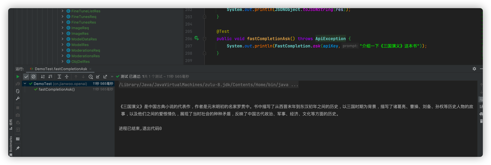

# ChatGpt official API package, GPT3.5 support! out of the box!

This SDK has been connected to all official SDKS, including text/event-stream asynchronously read data
It already supports the latest GPT3.5 model and the whisper-1 model, which supports voice function!

For details on how to use your own text for fine tuning, have uploaded relevant demo files and demo examples, see[DemoTest.fineTuneCreate和DemoTest.completionsAfterFineTunes](src%2Ftest%2Fjava%2Fcn%2Fjianwoo%2Fopenai%2FDemoTest.java)


[中文文档](README.md).

## Version log
- 1.0.0 Supports all OpenAI official interfaces, supports proxies, and supports streaming;
- 1.0.2 Supports the latest GPT-3.5-Turbo models and Whis-1 models;
- 1.0.3 Fixed some known problems;
- 1.0.4 Fixed some known problems [issues #5](https://github.com/gulihua10010/chatGptApiSdk/issues/5);
- 1.0.5 Stream Call added whether transfer complete field;
- 1.0.6 Support gpt-4, query billing credit grants, and customize Api endpoints;
- 1.0.7 Support to set the timeout, and whether timeout after the automatic retry (only support completions/completionsStream/completionsChat/completionsChatStream these four API), current response returned to increase the success of a field, If it is a failure, a failure message and exception details are returned, instead of throwing the runtime exception directly;
- 1.0.8 Fixed some known problems;
- 1.0.9 The official has fixed the bug in the billing details. The interface is unavailable and has been removed;
- 1.0.10 Added bill query function again, optimized stream request (okHttpClient set to singleton), added function of proxy set username and password
- 1.0.11 Fixed bug [issues #17](https://github.com/gulihua10010/chatGptApiSdk/issues/17);
- 1.0.12 Fixed the [EmbeddingsReq.java](src%2Fmain%2Fjava%2Fcn%2Fjianwoo%2Fopenai%2Fchatgptapi%2Fbo%2FEmbeddingsReq.java) parameter type problem [issues #23](https://github.com/gulihua10010/chatGptApiSdk/issues/23);


## Usage

### Import dependency

```xml

<dependency>
    <groupId>cn.jianwoo.openai</groupId>
    <artifactId>ChatGpt-API-SDK</artifactId>
    <version>1.0.12</version>
</dependency>

<!--If the dependency cannot be obtained, you can specify the repository address-->
<repositories>
<repository>
    <id>nexues</id>
    <name>snapshots</name>
    <url>https://s01.oss.sonatype.org/content/groups/public/</url>
    <releases>
        <enabled>true</enabled>
    </releases>
    <snapshots>
        <enabled>true</enabled>
        <updatePolicy>always</updatePolicy>
    </snapshots>
</repository>
</repositories>
```
### Call
```java
        // Init
        PostApiService service = new ChatGptApiPost(new OpenAiAuth("<apiKey>"));
        // Call
        CompletionRes res = service.completions(CompletionReq.builder().model("text-davinci-003").prompt("<问题>").build());

```
### GPT-3.5
```java
        // 初始化服务
        PostApiService service = new ChatGptApiPost(new OpenAiAuth("<apiKey>"));
        // 请求服务
        CompletionReq req = CompletionReq.builder().model(Model.GPT_35_TURBO.getName())
            .messages(
             Collections.singletonList(MessageReq.builder().role(Role.USER.getName()).content("你好").build()))
        .build();
        CompletionRes res = service.completionsChat(req);
        System.out.println(JSONObject.toJSONString(res))
```

### Use Proxy

```java
        // Init
        // &lt; host&gt; No http or https prefix!
        Proxy proxy = new Proxy(Proxy.Type.HTTP, new InetSocketAddress("<host>","<port>"))
        PostApiService service = new ChatGptApiPost(new OpenAiAuth("<apiKey>", proxy));
        // Call
        CompletionRes res = service.completions(CompletionReq.builder().model("text-davinci-003").prompt("<问题>").build());

```
### Asynchronous streaming reads the response


```java
    @Test
    public void completionsStream() throws Exception {
        CompletionReq req = CompletionReq.builder().model("text-ada-001").prompt("介绍下《水浒传》这本书").build();
        service.completionsStream(req, res -> {
             // Callback
             System.out.println(JSONObject.toJSONString(res));
        });
    }
```
### Quick Start
```java
    System.out.println(FastCompletion.ask("<apiKey>","介绍一下《三国演义》这本书"));
    System.out.println(FastCompletion.chat("<apiKey>","介绍一下《三国演义》这本书"));

```

### Generate a picture from the description
```java
    // Returns a url address
    ImageRes res = OpenAiAuth.builder().apiKey(apiKey).post()
        .imageCreate(ImageReq.builder().prompt(prompt).build());
        return res.getData().get(0).getUrl();
```

### Audio transcription
```java
        File audio = new File("/Users/gulihua/Downloads/audio.mp3");
        AudioReq req = AudioReq.builder().file(audio).build();
        AudioRes res = service.audioTranscribes(req);
        System.out.println(JSONObject.toJSONString(res));
```
## List of completed interfaces:
- [x] Models
- [x] Completions
- [x] Chat
- [x] Edits
- [x] Images
- [x] Embeddings
- [x] Audio
- [x] Files
- [x] Fine-tunes
- [x] Moderations
- [x] Engines


## Common model enumeration
```java
cn.jianwoo.openai.chatgptapi.constants.Model
```

## How to keep a conversation going/remember context
Just pass in the previous dialog, see the test case below

## Other ChatGPt-related items
- Wechat mini-program based on uni-app:https://github.com/gulihua10010/wxmini-chatgpt
- Wechat mini-program server API program:https://github.com/gulihua10010/chatGptApi
- OpenAi authorized SDK:https://github.com/gulihua10010/openAiAuth
- ChatGpt API SDK:https://github.com/gulihua10010/chatGptApiSdk
- ChatGpt Command line client:https://github.com/gulihua10010/ChatGpt

## Example

```java

import cn.jianwoo.openai.chatgptapi.completions.FastCompletion;
import org.junit.jupiter.api.Test;

import com.alibaba.fastjson2.JSONObject;
import cn.jianwoo.openai.chatgptapi.exception.ApiException;

@Test
public void fastCompletionAsk() throws ApiException {
        System.out.println(FastCompletion.ask(apiKey,"介绍一下《三国演义》这本书"));
}

```
### Output
```
The Romance of The Three Kingdoms is a representative work of Chinese classical novels written by Luo Guanzhong, a famous writer in the late Yuan Dynasty and early Ming Dynasty. The book describes the history from the late Western Jin Dynasty to the early Eastern Han Dynasty. With The Three Kingdoms period as the background, it describes the stories of Zhuge Liang, Cao Cao, Liu Bei, Sun Quan and other historical figures, as well as the love and hate between them. It shows the contradictions of the society at that time and reflects the history of ancient China's politics, military, economy and culture.```
```
## Test case

```java
    String apiKey = "sk-N*************************************goY";
    PostApiService service = new ChatGptApiPost(new OpenAiAuth(apiKey));

    /**
     *
     * List models
     *
     * @author gulihua
     */
    @Test
    public void models() throws ApiException
    {
        ModelRes res = service.models();
        System.out.println(JSONObject.toJSONString(res));
    }


    /**
     *
     * Retrieve model
     *
     * @author gulihua
     */
    @Test
    public void model() throws ApiException
    {
        ModelDataRes res = service.model("text-davinci-001");
        System.out.println(JSONObject.toJSONString(res));
    }


    /**
     *
     * Create completion
     *
     * @author gulihua
     */
    @Test
    public void completions() throws ApiException
    {
        CompletionReq req = CompletionReq.builder().model("text-ada-001").prompt("你好").build();
        CompletionRes res = service.completions(req);
        System.out.println(JSONObject.toJSONString(res));
    }

    /**
     *
     * Continuous dialogue
     *
     * @author gulihua
     */
    @Test
    public void completionsContext() throws ApiException
    {
        CompletionReq req = CompletionReq.builder().model(Model.TEXT_DAVINCI_003.getName())
            .stop("[\" Human:\", \" Bot:\"]").prompt("Human: 你好").build();
        CompletionRes res = service.completions(req);
        System.out.println(JSONObject.toJSONString(res));
        req.setPrompt(res.getAnswer() + "\n" + "Human: 你叫什么");
        res = service.completions(req);
        System.out.println(JSONObject.toJSONString(res));
    }


    /**
     *
     * Create completion (text/event-stream)
     *
     * @author gulihua
     */
    public static void completionsStream() throws Exception
    {
        CompletionReq req = CompletionReq.builder().model("text-davinci-003").prompt("你是什么模型").build();
        service.completionsStream(req, res -> {
            // Callback
            if (res != null)
            {
                System.out.println(res.getAnswer());
            }
        });
    }


    /**
     *
     * Continuous dialogue
     *
     * @author gulihua
     */
    @Test
    public void completionsChat() throws ApiException
    {
        CompletionReq req = CompletionReq.builder().model(Model.GPT_35_TURBO.getName())
        .messages(
            Collections.singletonList(MessageReq.builder().role(Role.USER.getName()).content("你好").build()))
        .build();
        CompletionRes res = service.completionsChat(req);
        System.out.println(JSONObject.toJSONString(res));
        }


    /**
     *
     * 使用gpt-3.5-turbo模型聊天
     *
     * @author gulihua
     */
    @Test
    public void completionsChatContext() throws ApiException
    {
        CompletionReq req = CompletionReq.builder().model(Model.GPT_35_TURBO.getName())
            .messages(
        Collections.singletonList(MessageReq.builder().role(Role.USER.getName()).content("请重复我的话").build()))
            .build();
        CompletionRes res = service.completionsChat(req);
        System.out.println(JSONObject.toJSONString(res));
        List<MessageReq> messages = new ArrayList<>();
        messages.add(res.getChoices().get(0).getMessage());
        messages.add(MessageReq.builder().role(Role.USER.getName()).content("我是中国人").build());
        req.setMessages(messages);
        res = service.completionsChat(req);
        System.out.println(JSONObject.toJSONString(res));
     }
    /**
     *
     * Create chat completion(text/event-stream)
     *
     * @author gulihua
     */
    public static void completionsChatStream() throws Exception
    {
        CompletionReq req = CompletionReq.builder().model(Model.GPT_35_TURBO.getName())
        .messages(
            Collections.singletonList(MessageReq.builder().role(Role.USER.getName()).content("你好").build()))
        .build();
        service.completionsChatStream(req, res -> {
        // 回调方法
        if (res != null)
        {
            System.out.println(res.getChatContent());
        }
        });
    }


    public static void main(String[] args) throws Exception
    {
    //        completionsStream();
        completionsChatStream();
    }

    /**
     *
     * Create edit
     *
     * @author gulihua
     */
    @Test
    public void completionsEdit() throws ApiException
    {
        CompletionReq req = CompletionReq.builder().model("text-davinci-edit-001").input("What day of the wek is it?")
                .instruction("Fix the spelling mistakes").build();
        CompletionRes res = service.completionsEdit(req);
        System.out.println(JSONObject.toJSONString(res));
    }


    /**
     *
     * Create image
     *
     * @author gulihua
     */
    @Test
    public void imageCreate() throws ApiException
    {
        ImageReq req = ImageReq.builder().prompt("cat").build();
        ImageRes res = service.imageCreate(req);
        System.out.println(JSONObject.toJSONString(res));
    }


    /**
     *
     * Create image edit
     *
     * @author gulihua
     */
    @Test
    public void imageEdit() throws ApiException
    {
        File cat = new File("/Users/gulihua/Downloads/cat.png");
        ImageReq req = ImageReq.builder().prompt("cat").image(cat).build();
        ImageRes res = service.imageEdit(req);
        System.out.println(JSONObject.toJSONString(res));
    }


    /**
     *
     * Create image variation
     *
     * @author gulihua
     */
    @Test
    public void imageVariate() throws ApiException
    {
        File cat = new File("/Users/gulihua/Downloads/cat.png");
        ImageReq req = ImageReq.builder().prompt("cat").image(cat).build();
        ImageRes res = service.imageVariate(req);
        System.out.println(JSONObject.toJSONString(res));
    }


    /**
     *
     * Create embeddings
     *
     * @author gulihua
     */
    @Test
    public void embeddingsCreate() throws ApiException
    {
        EmbeddingsReq req = EmbeddingsReq.builder().model("text-embedding-ada-002")
                .input("he food was delicious and the waiter...").build();
        EmbeddingsRes res = service.embeddingsCreate(req);
        System.out.println(JSONObject.toJSONString(res));
    }


    /**
     *
     * Create transcription
     *
     * @author gulihua
     */
    @Test
    public void audioTranscribes() throws ApiException
    {
        File audio = new File("/Users/gulihua/Downloads/audio.mp3");
        AudioReq req = AudioReq.builder().file(audio).build();
        AudioRes res = service.audioTranscribes(req);
        System.out.println(JSONObject.toJSONString(res));
    }


    /**
     *
     * Create translation
     *
     * @author gulihua
     */
    @Test
    public void audioTranslates() throws ApiException
    {
        File audio = new File("/Users/gulihua/Downloads/audio.mp3");
        AudioReq req = AudioReq.builder().file(audio).build();
        AudioRes res = service.audioTranslates(req);
        System.out.println(JSONObject.toJSONString(res));
    }
        
    /**
     *
     * List files
     *
     * @author gulihua
     */
    @Test
    public void fileList() throws ApiException
    {
        FileListRes res = service.fileList();
        System.out.println(JSONObject.toJSONString(res));
    }


    /**
     *
     * Upload file
     *
     * @author gulihua
     */
    @Test
    public void fileUpload() throws ApiException
    {
        File cat = new File("/Users/gulihua/Downloads/ChatGPT-Proxy-main-1/1.jsonl");
        FileReq req = FileReq.builder().purpose("fine-tune").file(cat).build();
        FileDetRes res = service.fileUpload(req);
        System.out.println(JSONObject.toJSONString(res));
    }


    /**
     *
     * Delete file
     *
     * @author gulihua
     */
    @Test
    public void fileDelete() throws ApiException
    {
        ObjDelRes res = service.fileDelete("file-jPU5wZkSxqkWJr32HlvnEou0");
        System.out.println(JSONObject.toJSONString(res));
    }


    /**
     *
     * Retrieve file
     *
     * @author gulihua
     */
    @Test
    public void fileRetrieve() throws ApiException
    {
        FileDetRes res = service.fileRetrieve("file-2HvmtSTWMTatG5mvRTPerMkn");
        System.out.println(JSONObject.toJSONString(res));
    }


    /**
     *
     * Retrieve file content
     *
     * @author gulihua
     */
    @Test
    public void fileRetrieveContent() throws ApiException
    {
        String res = service.fileRetrieveContent("file-2HvmtSTWMTatG5mvRTPerMkn");
        System.out.println(JSONObject.toJSONString(res));
    }


    /**
     *
     * Create fine-tune
     *
     * @author gulihua
     */
    @Test
    public void fineTuneCreate() throws ApiException
    {
        FineTunesReq req = FineTunesReq.builder().trainingFile("file-2HvmtSTWMTatG5mvRTPerMkn").build();
        FineTunesRes res = service.fineTuneCreate(req);
        System.out.println(JSONObject.toJSONString(res));
    }


    /**
     *
     * List fine-tunes
     *
     * @author gulihua
     */
    @Test
    public void fineTuneList() throws ApiException
    {
        FineTuneListRes res = service.fineTuneList();
        System.out.println(JSONObject.toJSONString(res));
    }


    /**
     *
     * Retrieve fine-tune
     *
     * @author gulihua
     */
    @Test
    public void fineTuneRetrieve() throws ApiException
    {
        FineTunesRes res = service.fineTuneRetrieve("ft-XyXOimCsBXnRc2Djpf52ghwl");
        System.out.println(JSONObject.toJSONString(res));
    }


    /**
     *
     * Cancel fine-tune
     *
     * @author gulihua
     */
    @Test
    public void fineTuneCancel() throws ApiException
    {
        FineTunesRes res = service.fineTuneCancel("ft-XyXOimCsBXnRc2Djpf52ghwl");
        System.out.println(JSONObject.toJSONString(res));
    }


    /**
     *
     * List fine-tune events
     *
     * @author gulihua
     */
    @Test
    public void fineTuneEventList() throws ApiException
    {
        EventListRes res = service.fineTuneEventList("ft-XyXOimCsBXnRc2Djpf52ghwl");
        System.out.println(JSONObject.toJSONString(res));
    }


    /**
     *
     * Delete fine-tune model
     *
     * @author gulihua
     */
    @Test
    public void fineTuneDelete() throws ApiException
    {
        ObjDelRes res = service.fineTuneDelete("curie:ft-acmeco-2021-03-03-21-44-20");
        System.out.println(JSONObject.toJSONString(res));
    }


    /**
     *
     * Create moderation
     *
     * @author gulihua
     */
    @Test
    public void moderationsCreate() throws ApiException
    {
        ModerationsReq req = ModerationsReq.builder().input("I want to kill them.").build();
        ModerationsRes res = service.moderationsCreate(req);
        System.out.println(JSONObject.toJSONString(res));
    }


    /**
     *
     * List enginesDeprecated
     *
     * @author gulihua
     */
    @Test
    public void enginesList() throws ApiException
    {
        EnginesListRes res = service.enginesList();
        System.out.println(JSONObject.toJSONString(res));
    }


    /**
     *
     * Retrieve engine
     *
     * @author gulihua
     */

    @Test
    public void enginesRetrieve() throws ApiException
    {
        EnginesDataRes res = service.enginesRetrieve("text-davinci-003");
        System.out.println(JSONObject.toJSONString(res));
    }


    /**
     *
     * Account information query: contains the total amount of information
     *
     * @author gulihua
     */
    
    @Test
    public void subscription() throws ApiException
    {
        Subscription res = service.subscription();
        System.out.println(JSONObject.toJSONString(res));
    }


    /**
     *
     * The account invocation interface can be used to query the consumption amount for a maximum of 100 days
     *
     * @author gulihua
     */
    
    @Test
    public void billingUsage() throws ApiException
    {
        Date startDate = DateUtil.parse("2023-03-01");
        Date endDate = DateUtil.parse("2023-04-01");
        BillingUsage res = service.billingUsage(startDate, endDate);
        System.out.println(JSONObject.toJSONString(res));
    }
        
    /**
     *
     * Completion Fastly
     *
     * @author gulihua
     */
    @Test
    public void fastCompletionAsk() throws ApiException
    {
        System.out.println(FastCompletion.ask(apiKey, "介绍一下《三国演义》这本书"));
    }

    /**
     *
     * Chat Fastly
     *
     * @author gulihua
     */
    @Test
    public void fastCompletionChat() throws ApiException
    {
        System.out.println(FastCompletion.chat(apiKey, "介绍一下《三国演义》这本书"));
    }

    /**
     *
     * Generate images Fastly
     *
     * @author gulihua
     */
    @Test
    public void fastCompletionAsk4Image() throws ApiException
    {
        System.out.println(FastCompletion.ask4Image(apiKey, "猫"));
    }
```